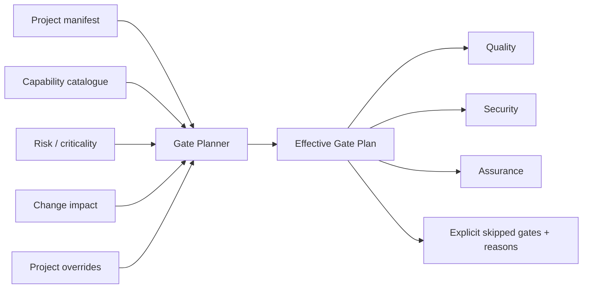
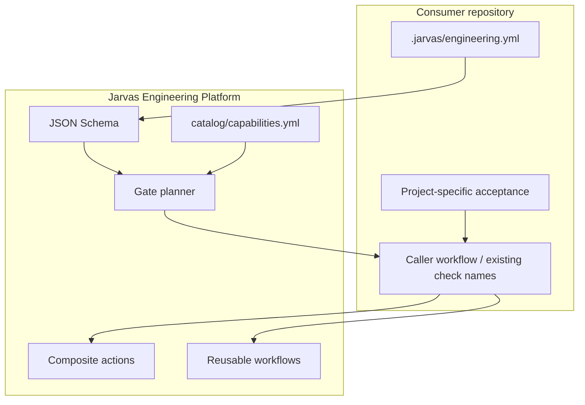
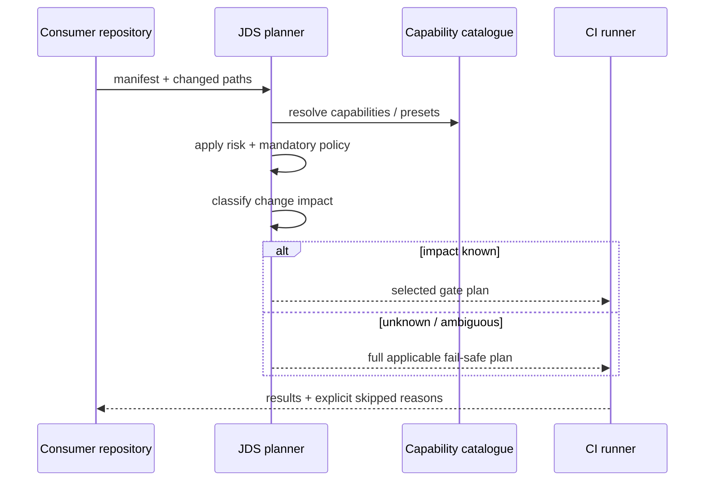

# Jarvas Engineering Platform

[](docs/00-platform-overview.md)
[](docs/JDS-001.md)
[](docs/00-platform-overview.md#current-state)
[](docs/gate-selection.md)
[](https://github.com/pestoura/jarvas-engineering-platform/actions/workflows/ci.yml)

> Central, executable engineering platform for the Jarvas/Hermes portfolio: **JDS-001**, capability catalogue, gate planning, reusable GitHub Actions and migration-safe quality/security building blocks.

## At a glance

| Question | Answer |
|---|---|
| **What is it?** | A reusable engineering-control layer for selecting and executing the right CI/assurance gates per repository. |
| **What does it execute today?** | Manifest validation, capability resolution, gate planning, reusable quality/security workflows and composite migration actions. |
| **What is authoritative?** | `docs/JDS-001.md`, `catalog/capabilities.yml`, `.jarvas/engineering.yml`, schemas and executable planner/workflows. |
| **What is it not?** | A deployment platform, an application runtime, a secrets manager, or a replacement for project-specific acceptance gates. |
| **Primary consumer model** | Repositories declare capabilities/risk; JDS computes an effective gate plan and callers execute the selected controls. |

## Why it exists

The Jarvas/Hermes portfolio contains repositories with very different technology stacks and risk profiles. A fixed CI template either becomes too weak for critical projects or too expensive for small changes.

JDS-001 therefore treats engineering assurance as a **policy-driven composition problem**:



The resulting plan is deterministic, auditable and fail-safe when change impact is ambiguous.

## JDS-001 execution model

```text
STANDARD
   +
CAPABILITIES
   +
OPTIONAL PRESET
   +
PROJECT OVERRIDES
   +
RISK / CRITICALITY
   +
CHANGE IMPACT
   ↓
EFFECTIVE GATE PLAN
```

Core invariants:

- capabilities are composable;
- presets are optional shortcuts, not closed project types;
- mandatory risk controls cannot be removed by project configuration;
- unknown or ambiguous change impact falls back to the full applicable plan;
- bounded WIP replaces mandatory lane/agent counts;
- the Integration Controller is a role, not an agent requirement;
- consumers pin the central platform by tag or immutable SHA;
- project-local controls remain until central parity is explicitly proven;
- every skipped capability/gate is visible and explainable.

## Architecture



Two consumption paths are intentionally supported:

1. **Reusable workflows** for new repositories or consumers that do not need to preserve an established required-check surface.
2. **Composite actions** for mature repositories that must keep existing job/check names while centralising implementation underneath them.

## Verified capabilities

The repository currently contains executable implementation for:

- JDS gate planning (`.github/actions/plan/planner.py`);
- capability and optional-preset catalogue (`catalog/capabilities.yml`);
- typed project engineering profile schema;
- Python, shell and schema quality composite actions;
- reusable Python, shell, schema, documentation, repository-security and container-assurance workflows;
- fresh-repository and consumer CI templates;
- regression tests for policy/planning behaviour;
- drift checks between this platform and `jarvas-project-template`.

### Explicitly not provided

This repository does **not** currently provide:

- application deployment/orchestration;
- production runtime supervision;
- credentials or secret material;
- a generic arbitrary-command runner;
- automatic retirement of mature project-local gates;
- proof that a central gate is equivalent to a project-specific gate unless parity evidence exists.

## Gate selection lifecycle



## Repository map

| Path | Purpose |
|---|---|
| `.jarvas/engineering.yml` | Self-hosted profile for this platform. |
| `catalog/capabilities.yml` | Canonical engineering capabilities and optional presets. |
| `schemas/` | Machine-readable manifest contracts. |
| `.github/actions/plan/` | Executable gate planner. |
| `.github/actions/*-quality/` | Composite actions designed to preserve caller check names. |
| `.github/workflows/reusable-*.yml` | Reusable quality/security/assurance jobs. |
| `templates/` | Consumer and fresh-repository reference material. |
| `tests/` | Planner/policy regression and drift tests. |
| `docs/` | Standard, consumption guidance and engineering decisions. |

## Documentation

Start with the [documentation index](docs/README.md).

- [Platform overview](docs/00-platform-overview.md)
- [JDS-001 — canonical delivery standard](docs/JDS-001.md)
- [Consuming the platform](docs/consuming-the-platform.md)
- [Gate selection model](docs/gate-selection.md)
- [Project template relationship](docs/project-template-repository.md)

## Consumption

Consumers should pin a release tag or immutable SHA. Do not point production repositories at a moving branch solely for convenience.

The baseline pattern is:

```yaml
# .jarvas/engineering.yml
metadata:
  name: example-project

engineering:
  criticality: standard
  capabilities:
    - python
```

The planner reconciles project declaration, policy, auto-detection and change impact before producing the effective gate plan. See [`docs/consuming-the-platform.md`](docs/consuming-the-platform.md) for the complete contract.

## Security and governance

The platform is deliberately **fail-closed** at the planning boundary. Mandatory repository security and release-evidence controls remain applicable even when a change appears small, and ambiguous classification cannot silently suppress assurance.

No secret values are required by the planner itself. Consumers remain responsible for their own credential and runtime trust boundaries.

## Current state

**Active and executable.** This repository is already the implementation source for JDS-001 and reusable engineering controls. It should be treated differently from a blueprint repository: code, workflows, schemas and tests exist and are the evidence for the capabilities above.

Future evolution should remain additive and evidence-driven: centralise generic controls where parity is demonstrable, while leaving product-specific acceptance close to the product that owns the risk.
