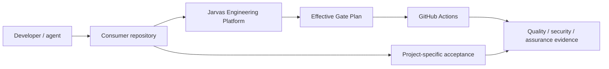
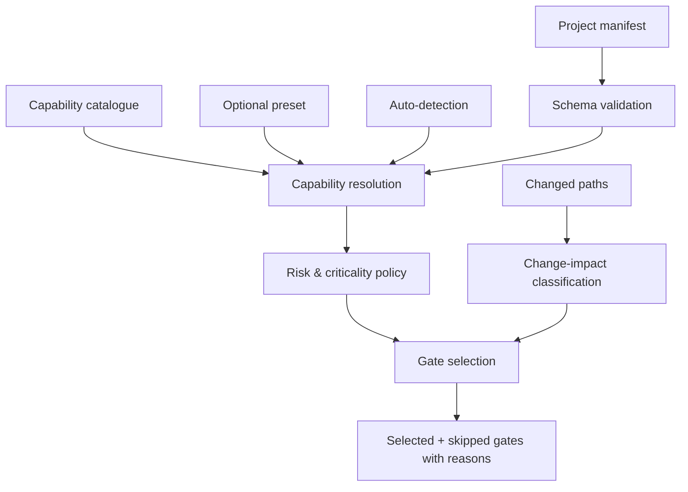
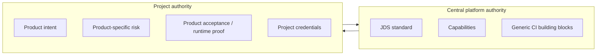
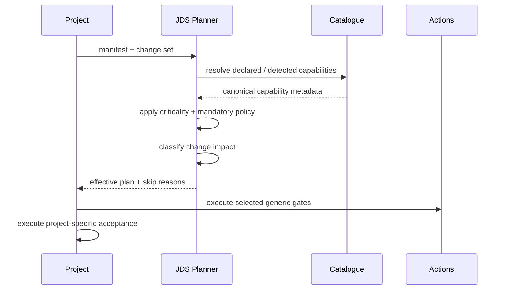

# Jarvas Engineering Platform — verified overview

**Documentation review:** 2026-08-09  
**Repository role:** executable engineering platform  
**Default branch:** `main`

## Purpose

The platform centralises generic engineering policy and CI building blocks used across the Jarvas/Hermes portfolio. It exists to reduce duplicated CI implementation without collapsing distinct product risk models into one universal pipeline.

## Current state

`ACTIVE / EXECUTABLE`

Evidence in this repository includes:

- executable gate planner code;
- typed manifest schema;
- capability catalogue;
- reusable workflows;
- composite actions;
- consumer/fresh-repository templates;
- regression tests and template-drift checks.

This is not a design-only repository.

## Capability model

| Capability area | State | Evidence |
|---|---|---|
| JDS-001 standard | Implemented | `docs/JDS-001.md` + planner/policy implementation |
| Capability catalogue | Implemented | `catalog/capabilities.yml` |
| Project engineering profile | Implemented | schema + `.jarvas/engineering.yml` |
| Effective gate planning | Implemented | `.github/actions/plan/planner.py` |
| Reusable quality workflows | Implemented | `.github/workflows/reusable-*.yml` |
| Migration-safe composite actions | Implemented | `.github/actions/*-quality/` |
| Project-specific product acceptance | External responsibility | stays in consumer until parity is proven |
| Runtime deployment/orchestration | Not provided | outside repository role |
| Secret management | Not provided | outside repository role |

## Context view

## Control view

## Trust / authority boundaries

Centralisation is intentionally **additive**. A generic central job may replace duplicate mechanics, but cannot silently take ownership of a product-specific safety decision.

## What the platform does not claim

The platform does not claim that:

- every repository needs the same gates;
- docs-only changes can always skip expensive controls;
- centrally available controls are automatically mandatory for every project;
- the existence of a reusable workflow proves parity with a mature local workflow;
- CI success proves live product support or production readiness.

## Consumer decision flow

## Evolution policy

Future platform work should follow three rules:

1. centralise generic mechanics only when the abstraction is stable;
2. preserve existing required-check identities where consumers depend on them;
3. retire local controls only after evidence demonstrates equivalent or stronger assurance.
